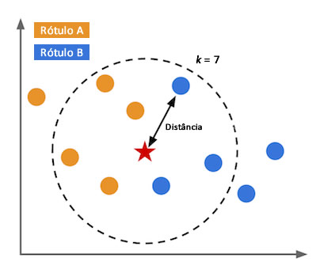

# K-Nearest Neighbours com Makefile

Este projeto faz parte de uma prática onde é exercitada a aplicação de makefile para a automatização de compilação e execução da aplicação

## O algoritmo KNN

A implementação em si consiste em um algoritmo básico de Machine Learning, que classifica um indivíduo a partir dos indivíduos com os valores dos atriutos mais próximos.

O KNN mede a distância euclidiana relativa entre um indivíduo analisado e os demais indivíduos de uma base de conhecimento para determinar K indivíduos que são mais próximos em valor.

A classe mais presente entre esses indivíduos vizinhos determinará a classe do indivíduo analisado.



## Execução

O arquivo de texto com um dataset de 150 indivíduos é lido. Indivíduos dos quais 105 são separados para servirem de base de conhecimento, enquanto os outros 45 são para os testes.

Cada teste é feito comparando a classe real do indivíduo e a classe obtida pelo algoritmo.

Com a base selecionada, nos 45 testes, há 43 acertos.

A cada teste é exibido o indivíduo testado, os K vizinhos encontrados, a classe esperada e a classe obtida.

No final é exibido o total de testes e total de acertos.

## Compilação e execução

```sh
# Compilação
make all
```

```sh
# Execução
make run
```

```sh
# Limpeza
make clean
```

```sh
# Recompilação
make clean all
```

> Projeto desenvolvido para ambiente GNU/Linux.